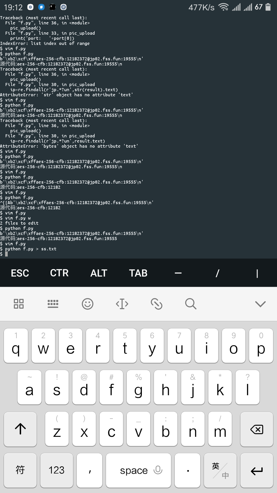

### 这是一个抓取ss免费账号网站的小爬虫(Python3)

##### 引用网站介绍

1. [FreeSS_Easy to Use](https://freess.cx/):二维码来源

2. [二维码解码器](http://jiema.wwei.cn/):进行二维码上传识别（二维码识别的API接口一般要收费，采用post在这类网站模拟上传是个好方法）

##### 要用的py库  

 `re  requests  base64`   

其中只有 ` requests ` 需要安装： `pip install requests` 

##### 存在的问题  

 `reg = r'aes.*?n:[0-9][0-9][0-9][0-9][0-9]'` 这一段正则表达式写的很蠢，会正则的人麻烦指正  

##### 效果图  

